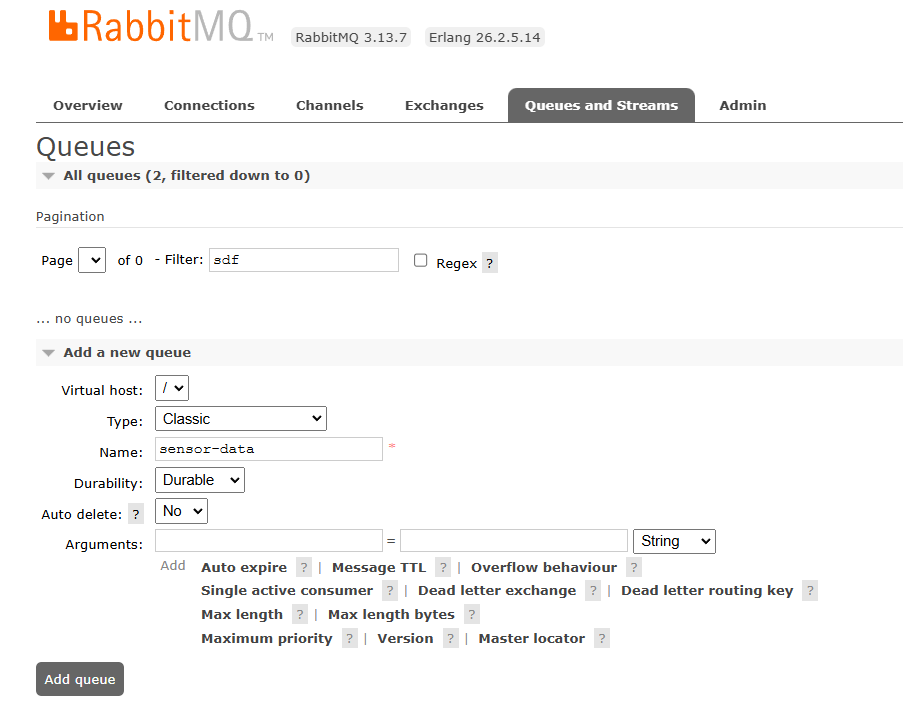
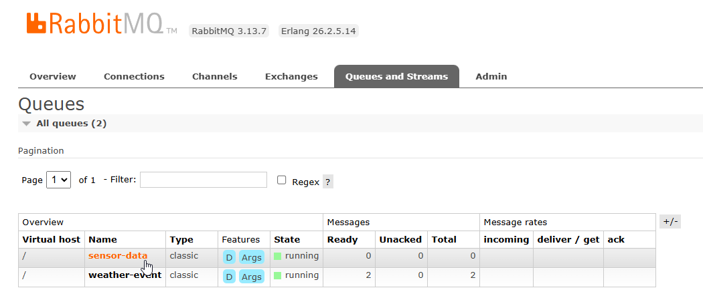
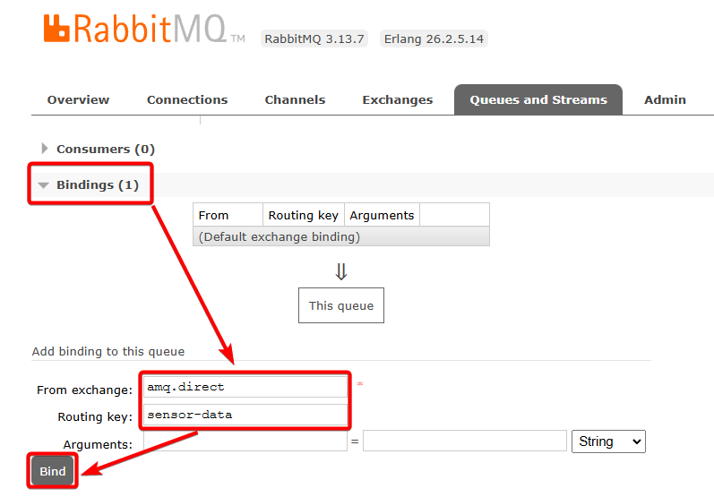

# ** 프로젝트에서 세팅 방법 **

## 🎯 컨테이너 생성부터 시작!

### 1. MQTT Broker
```bash
docker run -d -v "./container/mosquitto/config:/mosquitto/config" \
      -v "./container/mosquitto/script/mqtt_publish_json.sh:/mqtt_publish_json.sh" \
      -p 1883:1883 --name eclipse-mosquitto eclipse-mosquitto:2.0.22

# 정상적으로 실행 된 후에는 아래처럼 명령어 실행 해두기. 
# 이러면 1~3초 랜덤한 간격으로 센서 데이터 생성하여 camel/test/topic 토픽에 publish 한다.
docker exec -it eclipse-mosquitto ./mqtt_publish_json.sh 'camel/test/topic'
```

<br><br>

### 2. MongoDB

```bash
# mongodb container 실행
docker run -d --name mongo -p 27017:27017 \ 
        -e MONGO_INITDB_ROOT_USERNAME=admin -e MONGO_INITDB_ROOT_PASSWORD=secret \
        mongo:latest

# 정상 실행 후 아래처럼 명령어 입력해서 mongosh 열어보기
docker exec -it mongo mongosh -u admin -p secret
```
<br>

이후에 센서 데이터를 mongodb 에 넣게 되는데, 이것을 확인하려면 아래처럼 mongosh 명령어를 입력

```bash
use camel_db
db.sensorData.find().sort({timestamp:-1}).limit(3)
```

<br><br>

### 3. RabbitMQ

```bash
docker run -d --name rabbitmq -p 5672:5672 -p 15672:15672 rabbitmq:3.13-management
```
RabbitMQ 컨테이너 실행 후, 브라우저에서  http://localhost:15672/#/queues 로 접속합니다.<br>
이후 로그인도 진행해주세요. 로그인 계정은 `guest/guest` 입니다.<br>
<br>

그리고 나서 아래와 같이 Queue 를 하나 생성해줍니다.



- `Queues and Streams` 탭 클릭
- `Add a new Queue` 를 펼치고
- Queue 생성 정보 작성
  - Virtual host: `/`
  - Type: `Classic`
  - Name: `sensor-data`
  - Durability: `Durable`
  - Auto delete: `No`
- 이후 하단 좌측에 있는 `Add queue` 버튼 클릭

<br>

화면 새로고침을 하고, 생성된 큐가 목록에 나오면 이름 클릭



<br>

그리고 Bindings 를 펼쳐서 새로운 binding 설정을 추가한다.



- From exchange: `amq.direct`
- Routing key: `sensor-data`

<br><br><br><br>

## 🎯 프로젝트 실행방식

이후에는 [PlaygroundApplication.java](src/main/java/coding/toast/camelplayground/PlaygroundApplication.java) 에서 main 문을 실행해서<br>
Spring boot 애플리케이션을 실행하면 됩니다.<br>

다만 현재 [_0_mqtt_and_mongo](src/main/java/coding/toast/camelplayground/route/_0_mqtt_and_mongo) 패키지에 있는 Camel Route 클래스들이<br>
모두 `@Component` 애노테이션이 모두 주석된 상태입니다. <br>

MqttToMongoDBRoute_Try1 ~ 9 까지 Route 클래스가 있는데,
Try? 의 번호 순서대로 `@Component` 애노테이션이 주석을 한번씩 풀어서 Spring boot 애플리케이션을
실행해보면 됩니다.

```
아래와 같은 방법으로 차례대로 실행하면 됩니다.
1. Try1 @Component 주석 해제
2. Try2 @Component 주석 해제, Try1 @Component 다시 주석 처리
3. Try3 @Component 주석 해제, Try2 @Component 다시 주석 처리 
```


